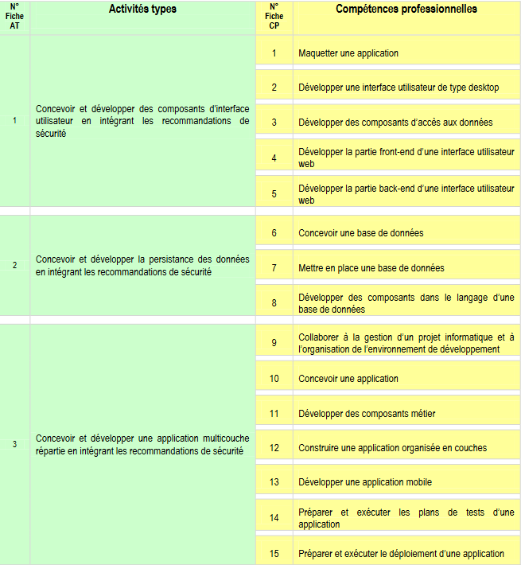

# Dossier de projet CDA

Ce document est un compte-rendu des compétences acquises dans le cadre de la formation préparant au titre de Concepteur Développeur d'Applications (CDA).  
À travers la présentation d'un projet professionnel réalisé en groupe, le dossier de projet fera état des connaissances et compétences acquises tout au long des 18 derniers mois.  

## Table des matières

1. [Remerciements](Remerciements/remerciements.md)
2. [Liste des compétences du référentiel qui sont couvertes par le projet](#liste-des-compétences-du-référentiel-qui-sont-couvertes-par-le-projet)
3. [Résumé du projet](Résumé%20du%20projet/résumé_du_projet.md)
4. [Cahier des charges](Cahier%20des%20charges/README.md)
5. [Gestion de projet](Gestion%20de%20projet/README.md)
6. [Spécifications fonctionnelles](Spécifications%20fonctionnelles/README.md)
7. [Spécifications techniques](Spécifications%20techniques/README.md)
8. [Réalisations](Réalisations/réalisations.md)
9. [Exemples](Exemples/README.md)
10. [Veille](Veille/veille.md)
11. [Et si c'était à refaire ?](Retrospective/retrospective.md)

## Liste des compétences du référentiel qui sont couvertes par le projet

